# QGIS plugin to access EDR services

Introduction
============

The QGIS EDR Plugin allows users of the open source geographical
information system to gain access to Open Geospatial Consortium (OGC)
API -Environmental Date Retrieval (EDR) compatible services. The
services will return data to the client machines and save it locally.
The plugin allows users to re-run saved queries for a particular
location, for example, given the nature of the spatio-temporal service
where data may change on a regular basis. This enables users to get the
latest copy of data for their area of interest.

Getting The Plugin
==================

If the QGIS EDR Plugin has not been installed, then the plugin can be
obtained from the official repository for QGIS plugins here:
<https://plugins.qgis.org/plugins/edr_plugin/>.

Using The Plugin
================

This section illustrates how the plugin is to be used.

After the QGIS plugin is installed, the user can begin a request for
data through an OGC API – EDR endpoint by clicking on the EDR icon.

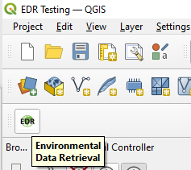

This will open the following dialog box which will enable the service to
be queried.

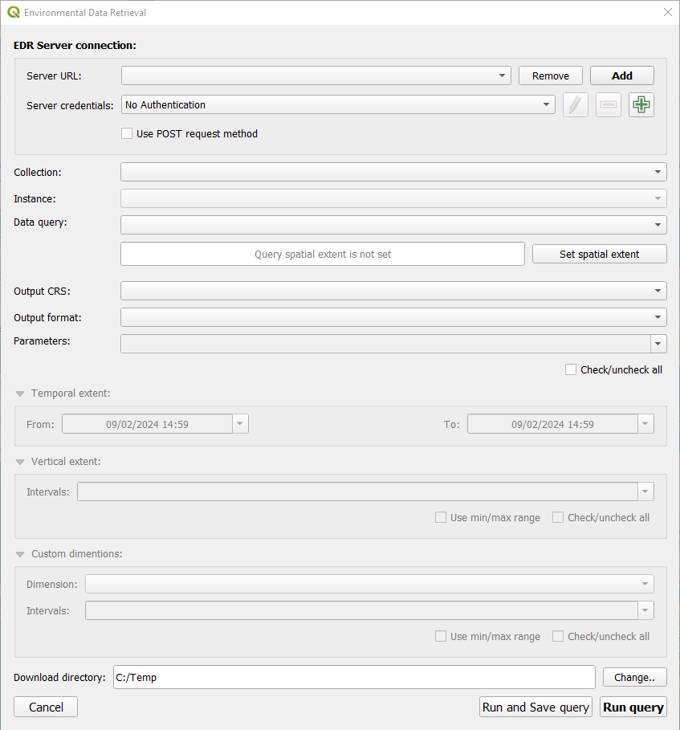

Overview Of The Plugin Connection Interface
-------------------------------------------

This illustrates the main features of the EDR dialogue.

Building an EDR Request
-----------------------

### Server Details

The first step is to add a new **Server URL**. This is the location of
the root for the EDR service from which QGIS can read the metadata for
the service.

Authentication: if the service is an authenticated service, then add
credentials for the service. Supported authentication includes the
following sets: API header, basic authentication (username and
password), identity certificate authentication, MapTiler HMAC-SHA256,
OAuth2, PKI PKCS\#12 and PKI paths authentication types.

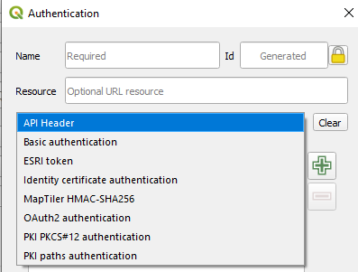

Each of these use the existing QGIS authentication management system and
will store details in the QGIS authentication database which is included
in QGIS. This will appear upon starting QGIS and needs a password to be
setup.

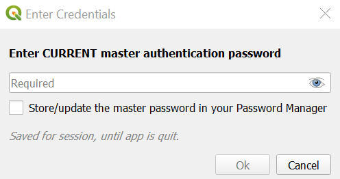

#### *HTTP Methods*

QGIS supports both GET and POST HTTP methods. It is possible to change
between the two by selecting the option to use POST queries or toggling
it off (as shown) which is the default and enables GET methods:

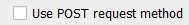

The main advantage of the POST request is to include more data in a
request to the EDR server (for example a bigger geometry object) as part
of the query request.

### Collection Options

When the service has been configured and a connection has been
successful, the collections along with any instances (if present) and
the data queries that the service supports will be shown in the drop
downs. This information is read from the service metadata and will be
displayed in the drop down menus for each of these. It is possible to
select values from the options for the service.

If the service metadata does not support instances for example, then no
instances will be present. Data query options will be those available in
the EDR service.

#### Setting the Spatial Extent

The spatial extent needs to be created based upon the type of query
type. To set the spatial extent, the ‘Set spatial extent’ button should
be clicked. This will open a dialogue box that will vary according to
the data query type. A polygon will be created for an area query, a
point for a position query and a circle radius based on a centre point
for the radius query for example. These are shown in detail below.

Should the spatial extent not be set, and the user attempts to run the
query, then there will be a warning message before the user is prompted
to select the extent after clicking OK.

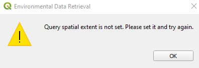

The user will then be given an option to input the extent for the query.

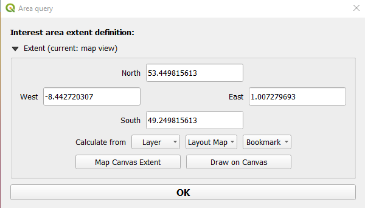

1.  **Area Query** – the user has the option to enter a rectangular
    extent based upon maximum values for the north, west, east and south
    coordinate values, there is an option to use the map canvas extent
    that is showing or there is an option to draw a rectangular area on
    the map.

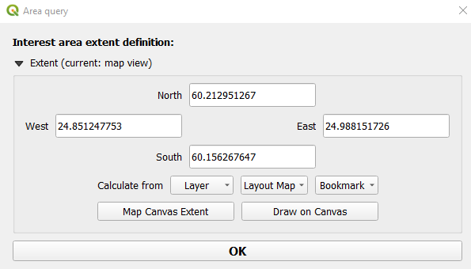

Clicking on the **Map Canvas Extent** button the coordinates of the
existing map view will be added to the north, west, east and south
values to form a rectangle based upon the current map view.

The **Draw on Canvas** option allows the user to select a rectangular
area from the background map. Select the top left corner of the bounding
box and drag the area to form a bounding box. Upon completion the
coordinates will be populated in the north, west, east and south boxes.

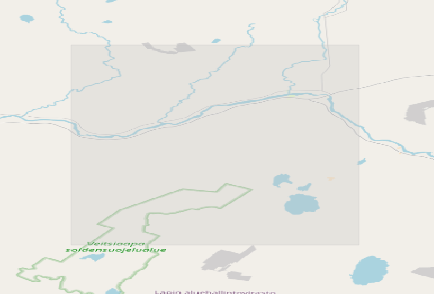

It is also possible to create an extent from a pre-existing **layer**
that is present in the QGIS project. Select the layer option and select
the layer that the area should be. There are also options to select a
**layout map** or from pre-saved **bookmarks**. Each of these options
functions in the same way, bringing in a selected geometry.

1.  **Position Query** – when a data query of position is selected the
    user will be prompted to select a point from the map when clicking
    on the set spatial extent button.

2.  **Radius Query** – a radius data query enables the user to create a
    radius from a centre point with a defined radius in particular
    units. Select a radius query, then select the set spatial extent
    button which will show the following dialogue:

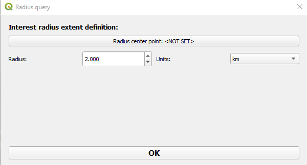

Click on the Radius centre point: &lt;NOT SET&gt; to select a point on
the map and select the desired radius value and units from the drop down
list. It is possible to change the radius values by typing into the text
box or use the selectors to increase or decrease the values by 1.

1.  **Locations Query** – when the locations query type is selected the
    set spatial extent button reveals a list of possible location to
    select. The list is presented in a drop down menu, and the user can
    then select the location that is of interest.

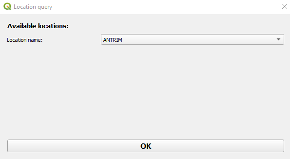

Select one of the location names and then click on the OK button to get
data for the pre-defined location.

1.  **Items Query** – this query allows users to select a particular
    pre-defined item from the EDR service and it behaves in a similar
    way to the locations. When the user has selected an items query type
    and clicked on the set spatial extent button then a list of
    available items is displayed to be selected from the drop down menu.
    Select a value and click OK.

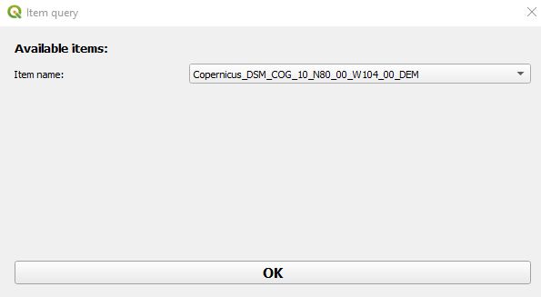

Selected items will be displayed on the EDR interface:

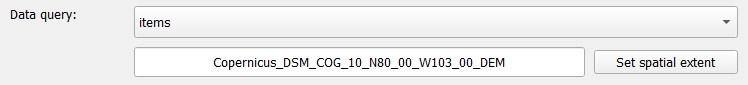

1.  **Other queries** of **corridor**, **cube** and **trajectory** are
    not (yet) supported by the QGIS EDR
    plugin.

### Setting Output Options

There are two output options to select: the **output coordinate
reference system (CRS)** and the **output format**. The CRS options are
based upon the supported service as well as the output formats.

**NOTE:** The QGIS plugin officially supports output formats of NetCDF4,
GRIB2 and CovJSON, however, other formats such as geotiff, geojson are
supported and do work.

### Setting Parameters

Some services provide parameters that can be selected. When present the
parameters will appear in the Parameters drop down menu list and may be
selected from this list, either individually or a selection of more than
one. Select a parameter by ticking the tick box.

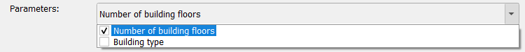

There is an option to select or deselect all parameters. By ticking or
unticking this option, all available parameters will be selected or
deselected. When it is selected all parameters will be shown as a comma
delimited list in the parameters text on the drop down menu.

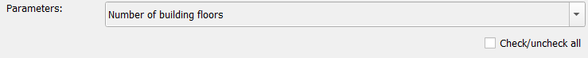

Extents and Dimensions
----------------------

The Environmental Data Retrieval API has been created with temporal and
spatial data in mind. It works with multi-dimensional data that has a
temporal, vertical and multidimensional aspects that include instances.
There are also custom dimensions that a service can provide.

### Temporal Extent

For any EDR collection that supports temporal data the temporal extent
shall be shown for the collection. The values will be dynamically shown
when they are present. It is possible to change the time range from the
dropdown menus for the ‘from’ and ‘to’ values.

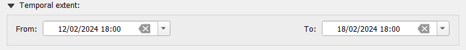

Clicking on the dropdown menu allows the user to select another date
from a calendar date picker. It is possible to select a different date
within the range of the temporal extent.

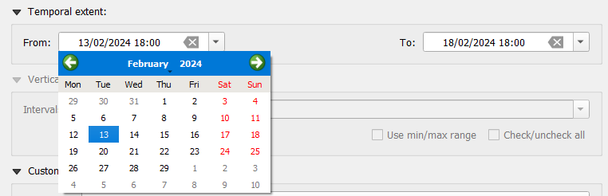

The time values may be edited in the text boxes by overtyping the values
present. This applies to the ‘from’ and the ‘to’ extents.

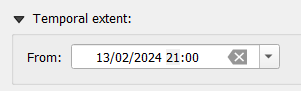

### Vertical Extent

When vertical extents are supported by the collection in the service,
then there is an option to select these manually from the drop down
menu. If the service does not support a vertical extent this option will
be greyed out.

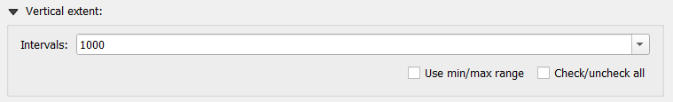

Select as many vertical extents as needed by selecting values from the
drop down menu using the tick boxes.

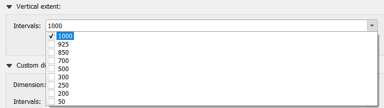

There is also an option to select the minimum and maximum range (click
the use min/max range tick box) or to select or deselect all (use the
check/uncheck all tick box).

Selecting all will show all values as a delimited list in the text box:

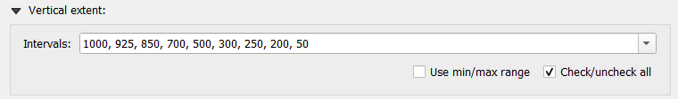

### Custom Dimensions

A service may have further dimensions defined as custom dimensions and
these will appear in the drop down menu when they are in the service
metadata.

The dimension dropdown menu shall display all available dimensions that
the service offers, there is an option to select this. The intervals
option allows users to select either individual or multiple values by
means of the drop down menu.

There is also an option to select the minimum and maximum range (click
the use min/max range tick box) or to select or deselect all (use the
check/uncheck all tick box). Selecting all will show all values as a
delimited list in the text box.

Download Directory
------------------

The final option to select on the EDR plugin interface is the directory
where files returned from the service will be saved.

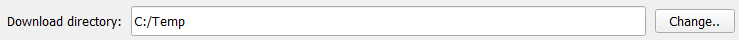

This can be altered by clicking on the change button and navigating to a
directory location where the user wants to save EDR data.

After all of the above has been selected, there are some options to
execute the query that has been built.

Running The Query
-----------------

There are three options for running the query: the first is to cancel
the query by using the Cancel option. This will cancel the query and not
run it. There is an option to run and save the query (Run and save
query) and another just to run the query (Run query).

The run and save query will create an entry in the **QGIS Browser** view
to be able to re-run the same EDR API request later. This has the
advantage of being able to specify an area for example and allows the
user to re-use parameters to get an updated set of data in the future.
The saved queries will appear under the Environmental Data Retrieval
heading (highlighted below):

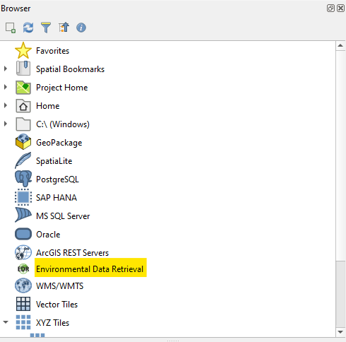

Running the query will just download the file format defined into the
directory that has been specified. When the query is running a blue will
appear above the map. This shows the user the collection being selected
and highlights the progress.

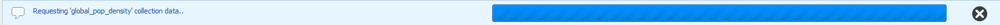

Data will be downloaded to the specified directory in the chosen file
format. When it is downloaded the file will appear on the **QGIS
Layers** list and can be interacted with (toggled off and on for
example) from here. It is possible to change the properties of the layer
from this view.

### Working with Saved Queries

When an EDR query has been saved the service will appear under the
Environmental Data Retrieval heading in the QGIS Browser view (if this
is not visible it can be opened from the menu: View, then Panels and
Browser). The query will appear with the service URL. By right clicking
on this there are options to have a new server query or delete the
service reference from the Browser panel.

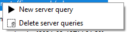

Below the service URL will be a collection name with a date when the
query was executed.

By right clicking on the saved query a menu will appear with options to:

1.  Repeat the query. This will re-run the query as it is.

2.  Rename the query. This enables the query to be renamed.

3.  Delete the query. This allows the query to be deleted.

Guidance: Working With The QGIS Plugin
======================================

The following section highlights how QGIS works with certain types of
data and file types. It gives some hints to users on how best to use the
plugin with the different types of data.

Temporally Enabled Data
-----------------------

Where data has a temporal (time) element then the temporal navigation
tool will enable it to be animated through time. To get this go to the
menu item View, Panels, Temporal Controller. This will show the
controller:

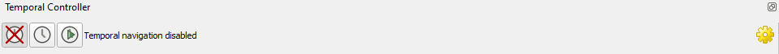

Temporally enabled layers will have a clock icon next to them in the
QGIS Layers panel.

Viewing NetCDF Data
-------------------

The NetCDF files may not apparently appear on the map layer when they
are downloaded and added as a layer in QGIS. To resolve this issue,
which may be associated with the temporal controller, ensure that the
temporal navigation is turned off.

Navigate to the temporal controller and disable the control by clicking
on the ‘turn off temporal navigation’ button (the lefthand button with
the red cross). It will be shown as disabled:

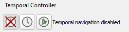

This should make the NetCDF file appear on the map view.

Viewing CovJSON Data
--------------------

The CovJSON data sometimes may not appear on the map, with the temporal
controller enabled, if this is the case refresh the temporal range from
the temporal controller by clicking on the ‘set to full range’ (refresh)
button. This is the two blue arrows on the right of the image below.

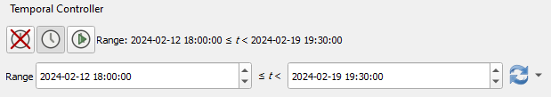

Working With Multiple Vertical Extents
--------------------------------------

When there is a dataset with multiple vertical extents the user can
navigate between each vertical level by using the layers panel to turn
layers off and on.

Here data is displayed for the temperature on 13 February 2024 18:00
model run at three vertical height levels: 850, 925 and 1000.

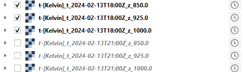

For a NetCDF file it is possible to change the vertical levels by using
the symbology groups control to toggle each level on or off:

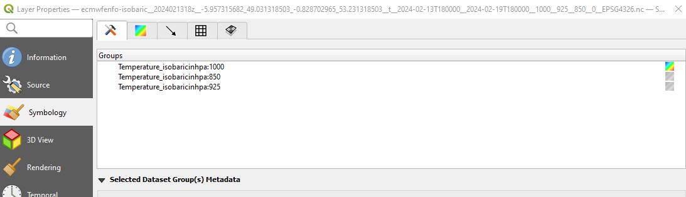

In the above diagram the isobaric 1000 vertical height level is on, it
is possible to click on another value to enable other vertical height
levels.

